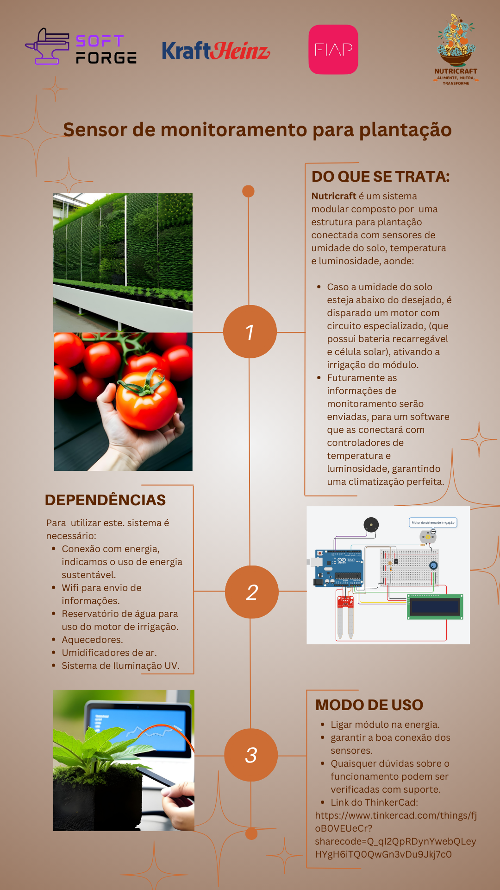

## Link para acesso pelo [ThinkerCad](https://www.tinkercad.com/things/fjoB0VEUeCr?sharecode=Q_qI2QpRDynYwebQLeyHYgH6iTQ0QwGn3vDu9Jkj7c0).

## Pessoas desenvolvedoras:

| Aluno  | Rm |
| ----------------- | ------------- |
| Gustavo Cristiano | 551924  |
| Luna Gouvea  | 550836  |
| Rony Ken Nagai  | 551549  |
| Tomáz V Carballo | 551417  |
